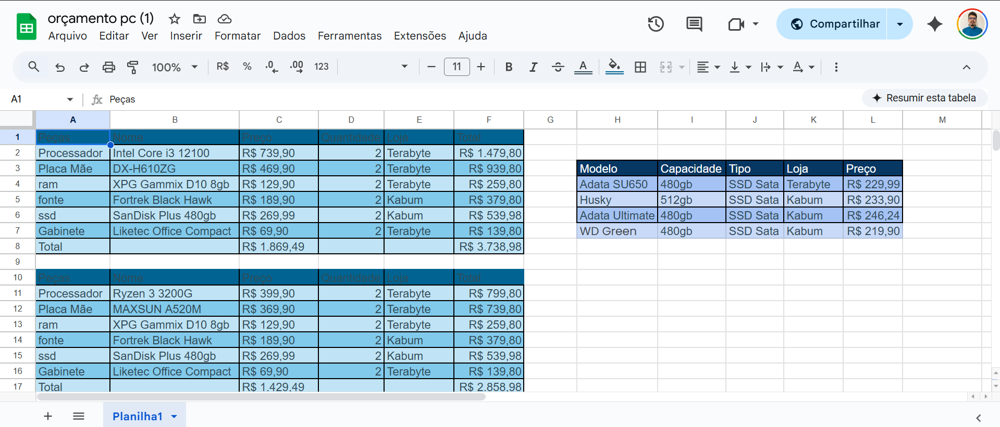

# 📊 Ferramenta de Orçamento para Montagem de PCs

## 📄 Descrição do Projeto

Este projeto consiste em uma ferramenta desenvolvida em Microsoft Excel para agilizar e otimizar o processo de cotação de hardware e montagem de computadores (PC "builds") com diferentes perfis de desempenho e custo.

## 🎯 Problema Resolvido

No cenário de montagem de computadores, o processo de orçar diferentes configurações é frequentemente manual, repetitivo e suscetível a erros. Esta ferramenta foi criada para centralizar as informações, automatizar os cálculos e permitir a comparação rápida entre diferentes "builds", economizando tempo e garantindo precisão nos orçamentos.

## ✨ Funcionalidades Principais

* **Templates de Builds:** A planilha é estruturada em blocos, onde cada bloco representa uma configuração de PC completa para um perfil específico (ex: "PC de Escritório Intel i3", "PC Gamer Custo-Benefício").
* **Cálculo Automatizado:** O custo total de cada componente (preço x quantidade) e o custo final de cada build são calculados automaticamente, eliminando a necessidade de cálculos manuais.
* **Seleção de Fornecedores:** Permite a especificação da loja (ex: Terabyte, Kabum!) para cada componente, mantendo o orçamento organizado.
* **Escalabilidade:** A estrutura modular facilita a adição de novas configurações de PC conforme a necessidade.

## 🛠️ Ferramentas e Conceitos Aplicados

* **Microsoft Excel:** Estruturação de dados, interface e cálculos.
* **Fórmulas Avançadas:** Utilização de `SOMA`, `MULTIPLICAÇÃO` e outras funções para garantir a automação e precisão dos valores.
* **Estruturação e Organização de Dados:** Planejamento da planilha para ser clara, funcional e de fácil manutenção.

## 📸 Screenshot do Projeto

Abaixo, uma imagem demonstrando a estrutura e funcionalidade principal da planilha:

## 🚀 Versão Interativa (Google Sheets)

Para uma demonstração ao vivo da planilha, onde você pode interagir com os dados, acesse a versão online no Google Sheets:

➡️ **[Abrir a Planilha de Orçamento no Google Sheets](https://docs.google.com/spreadsheets/d/1Q-wpXYcnK425hXyvax2jZjqVx6BQ6qw-mn8vWMGqHLo/edit?usp=sharing)**

## 👨‍💻 Autor

Desenvolvido por **Phablo**.

* **LinkedIn:** [linkedin.com/in/phabloycosta](https://www.linkedin.com/in/phabloycosta/)
* **GitHub:** [github.com/PhabloY](https://github.com/PhabloY)

## 📜 Licença

Este projeto está sob a licença MIT. Veja o arquivo [LICENSE](LICENSE) para mais detalhes.
